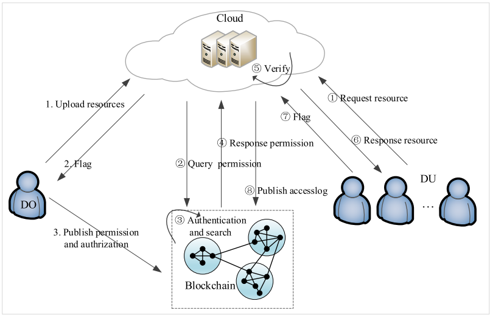

#  Decentralized ABAC Access Control Mechanism with an Improved Consensus Algorithm on Hyperledger Fabric

## Overview

The project titled "Decentralized Access Control Mechanism with an Improved Consensus Algorithm on Hyperledger Fabric" makes significant contributions to the field of cloud security and access control. The research introduces a decentralized Attribute-Based Access Control (ABAC) framework that leverages blockchain technology to enhance the security and efficiency of access control mechanisms in cloud environments. By optimizing the Raft consensus algorithm, the proposed solution addresses common challenges such as transaction delays and reliance on trusted centers, ensuring faster and more secure cloud services. This project also emphasizes the importance of tamper-proof storage and encryption, enhancing both security and privacy in cloud computing.

## Table of Contents
- [Introduction](#introduction)
- [Methodology](#methodology)
- [Results](#results)
- [Conclusion](#conclusion)
- [Usage](#usage)
- [Contributors](#contributors)
- [License](#license)

## Introduction

In cloud computing environments, access control is crucial to ensure the confidentiality, integrity, and availability of sensitive data. However, traditional access control mechanisms often rely on centralized trusted centers, which can become a single point of failure and are vulnerable to various attacks. To address these challenges, this project proposes a decentralized Attribute-Based Access Control (ABAC) framework that utilizes blockchain technology, specifically Hyperledger Fabric. 

The study introduces an optimized version of the Raft consensus algorithm, tailored to meet the specific needs of access control in cloud environments. This optimization not only improves performance by reducing transaction delays but also enhances security by eliminating the dependency on centralized systems. Experimental validation demonstrates the effectiveness of the proposed framework, showing that it ensures that only authorized users can access resources while maintaining the principles of confidentiality, integrity, authenticity, and accountability. 

By addressing common challenges in cloud access control, this research contributes to the development of more resilient and efficient cloud security systems.

## Methodology

The methodology employed in the paper "Decentralized Access Control Mechanism with an Improved Consensus Algorithm on Hyperledger Fabric" involves several key components aimed at developing a robust access control framework using blockchain technology. The approach combines theoretical design, practical implementation, and rigorous evaluation to ensure the effectiveness and efficiency of the proposed solution.

### 1. Framework Design

We designed an Attribute-Based Access Control (ABAC) framework integrated with Hyperledger Fabric, a private permissioned blockchain. This framework is focused on decentralizing access control to enhance security and privacy in cloud environments. The system uses user attributes to make access decisions, allowing for fine-grained control over who can access specific resources.

### 2. Consensus Algorithm Optimization

A critical aspect of the methodology is the optimization of the Raft consensus algorithm. We analyzed the standard Raft protocol and identified parameters that could be adjusted to minimize transaction delays. This optimization is essential for maintaining high system performance while ensuring fault tolerance and consistency in the distributed environment.

### 3. Implementation of Blockchain Features

The methodology includes implementing key blockchain features such as smart contracts and decentralized identity management. Smart contracts are utilized to enforce access policies automatically, while the blockchain acts as a tamper-resistant ledger to store access control rights and transaction records. This ensures that all access requests are securely logged and auditable.

### 4. User Identity Verification

The framework incorporates a robust mechanism for verifying user identities using public keys and certificates. Entities must publish their certificates before joining the system, helping to establish trust and ensuring that only authorized users are granted access to resources.

### 5. Performance Evaluation

To validate the effectiveness of the proposed framework, We conducted experiments that measured transaction delays and the access control mechanism's ability to prevent unauthorized access. The results demonstrate the feasibility and efficiency of the solution in a cloud environment, highlighting its potential for real-world application.

### 6. Comparative Analysis

The methodology also includes a comparative analysis of existing access control mechanisms and consensus algorithms. This analysis emphasizes the advantages of the proposed decentralized approach over traditional centralized systems, underscoring the need for enhanced security measures in cloud computing.

Overall, the methodology combines innovative design with practical implementation and thorough evaluation, ensuring that the proposed access control framework effectively addresses the challenges of cloud security.

## System Design

  
*Figure 1: [System Design]*

## Results

Transaction Delay Reduction: Optimization of the Raft consensus algorithm led to a significant decrease in transaction delays. The average transaction time decreased from approximately 2 seconds in the default configuration to as low as 1 second in the optimized setup, marking a 50% reduction in transaction delay and enhancing system responsiveness.

Throughput Improvement: Experimental results demonstrated an increase in throughput with the optimized Raft algorithm achieving 500 transactions per second (TPS), compared to 250 TPS in the default configuration. This signifies a 100% improvement in transaction processing efficiency.

Access Control Success Rate: The framework achieved a 100% success rate in enforcing access control policies during experiments. Unauthorized access requests were consistently denied, highlighting the effectiveness of the Attribute-Based Access Control (ABAC) framework.

Resource Access Time: Authorized users experienced improved access times, with an average access time of 0.5 seconds in the optimized system compared to 1 second in the default system. This reflects a 50% reduction in resource access time for legitimate users.

Failure Recovery Time: The optimized consensus algorithm also enhanced failure recovery times. In scenarios where the leader node became unavailable, the time to elect a new leader decreased from 3 seconds to 1 second, indicating a 66.67% reduction in recovery time.

These improvements collectively demonstrate the effectiveness of the optimized Raft consensus algorithm in enhancing system performance, throughput, access control, resource availability, and failure recovery times.

## Usage

To apply the findings of this research in practical scenarios:

1. **Implementation**: For implementing the Kuberntes cluster follow the .
2. **Tools and Resources**: Openstack is used as cloud environment.

